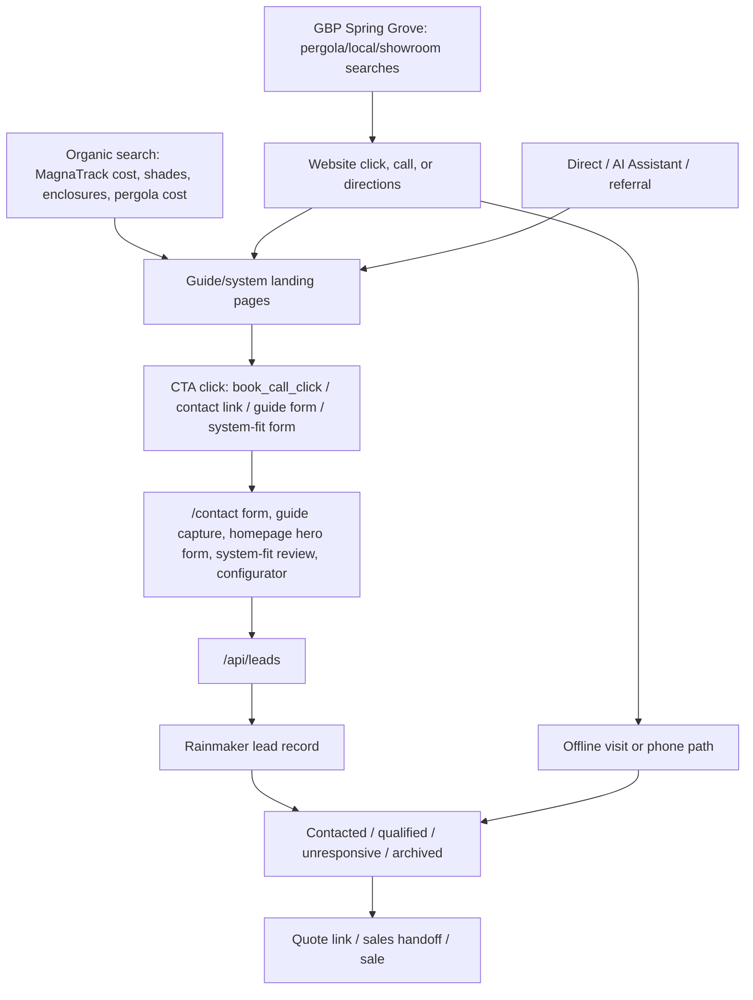

# EDG Website Conversion Rate Strategy Memo - 2026-07-02

## Executive Verdict

EDG should not start with a sitewide redesign or generic CTA copy pass. The best first move is a small, instrumented "system-fit review" conversion pilot on the highest-intent screen and pergola paths, paired with tracking and Rainmaker context cleanup.

The most likely current bottleneck is not that the form is too hard to submit. The form is fairly low-friction, and the contact page converts when people reach it. The bigger issue is that high-intent visitors are landing on system/cost pages and are not always being routed into a page-specific next step that preserves enough project context for sales. At the same time, EDG cannot fully measure the funnel yet because configurator leads, phone clicks, and Rainmaker metadata are incomplete.

Recommended first strategy:

1. Instrument the funnel correctly enough to judge the pilot.
2. Improve page-specific CTAs and lead capture on the highest-intent screens/pergolas journeys.
3. Preserve source, page, CTA, query, and system-fit context into Rainmaker.
4. Review follow-up quality on the recent qualified/system-specific leads before changing the entire website.

## Evidence Table

| Proof layer | What was verified | What it implies |
|---|---|---|
| Search Console | Last 28 days, June 3-30: 400 clicks, 32.3K impressions, 1.2% CTR, avg position 19.2. `/guides/magnatrack-screens-cost` had 204 clicks, about 51% of search clicks. | Organic traffic is working, but current SEO demand is screen-cost heavy. Conversion work should prioritize the screen-cost and shade journey first, while not ignoring pergola demand from GBP. |
| GA4 landing pages | Last 28 days, June 4-July 1: 853 sessions, 21 key events, 2.23% avg session key-event rate. `/guides/magnatrack-screens-cost` had 225 sessions and 3 key events, 1.33%. `/contact` had 40 sessions and 4 key events, 10%. | The contact page can convert users who arrive there. The bigger opportunity is upstream: make high-intent landing pages produce more qualified form starts/submits. |
| GA4 events | Last 28 days: `book_call_click` 82 events / 74 users, `generate_lead` 21 events / 19 users, `phone_click` 3 events / 2 users. | There is measurable CTA intent before submission. Phone tracking is almost certainly incomplete. |
| Rainmaker | 68 total lead records. Last 28 days: 33 records, including 4 known Codex/test records. Status mix last 28: 15 unresponsive, 14 contacted, 3 qualified, 1 archived. 6 / 33 had quote links. | Raw lead count overstates real demand. Lead quality and follow-up truth matter as much as form conversion rate. |
| Rainmaker source mix | Last 28 days: `planning-guide-hero` 8, `contact_page` 6, `hero_form` 4, `pergola_system_fit_review` 3, `magnatrack_cost_guide` 2, `pergola-configurator` 2. | Generic and guide captures produce volume, but product/fit-specific paths appear more sales-relevant. |
| Recent lead quality | Three most recent July 1 records were `contact_page`, `unresponsive`, and appeared to be vendor/SEO/AI outreach or irrelevant demand. June 25-29 included stronger project signals from MagnaTrack, shades, Chicago, hero, planning guide, and configurator paths. | The contact page is a noise entry point. Better qualifying context and spam/vendor filtering should be part of conversion work. |
| GBP Spring Grove | Feb-Jul: 477 interactions, 266 directions, 200 website clicks, 11 calls. June alone: 94 interactions, 62 directions, 29 website clicks, 3 calls. Top term: `pergola` 664. | GBP is a separate local/offline funnel, not just website form traffic. It is pergola-heavy, while Search Console is screen-heavy. |
| Repo/source | Contact page reads query context, but many CTAs are plain `/contact`. Website sends core lead fields to Rainmaker but not metadata. Configurator posts directly to `/api/leads` and bypasses the shared `generate_lead` hook. | Attribution and context are being flattened. The configurator is undercounted in GA4. |
| Phone tracking | Repo scan found 32 `tel:` hrefs; only 8 `TrackedPhoneLink` usages and 1 tracked tel `TrackedLink`. | Website phone intent cannot be trusted from GA4 yet. Fix tracking before deciding phone is minor. |

## Conversion Funnel Map

Important caveats:

- GA4 `generate_lead` does not fully equal Rainmaker leads because some paths may bypass the shared tracking hook, and spam fake-success responses intentionally do not create real leads.
- Rainmaker lead status does not equal sales conversion. `converted` is not currently used, even when some leads have quote records.
- GBP calls/directions and website form submissions are separate proof layers.

## Ranked Hypotheses

| Rank | Hypothesis | Confidence | Expected impact | Effort | Evidence quality | Downside risk |
|---:|---|---|---|---|---|---|
| 1 | EDG cannot judge conversion accurately until lead events, phone clicks, configurator submits, and Rainmaker context are cleaned up. | High | High | Low-medium | High | Low |
| 2 | High-intent screen visitors need a more specific next action than generic contact: "screen fit + budget range" or "send openings/photos for a recommendation." | Medium-high | High | Medium | High | Medium if form friction rises too much |
| 3 | Generic contact and guide-capture leads are creating noise and thin context, especially vendor/spam outreach and no-phone/no-project records. | High | Medium | Medium | High | Low-medium |
| 4 | The pergola configurator/system-fit flow is commercially useful but under-measured. | Medium-high | Medium-high | Low-medium | Medium-high | Low |
| 5 | Some conversion leakage is after capture: response speed, qualification, quote handoff, or status discipline. | Medium | High | Medium | Medium-low | Low |
| 6 | A broad visual redesign is the best first move. | Low | Unclear | High | Low | High |

## Recommended 2-Week Pilot

Pilot name: System-fit review and quote-readiness pilot.

Primary pages and flows:

- `/guides/magnatrack-screens-cost`
- `/systems/shades`
- `/systems/pergolas`
- `/systems/pergolas/configure`
- `/guides/pergola-cost`
- Homepage hero form as the control/reference path

Core change to test after approval:

- Replace generic "contact/get quote" framing on high-intent sections with page-specific system-fit offers.
- For MagnaTrack/shades: "Get a screen fit and budget range" and "Send your openings/photos for a MagnaTrack recommendation."
- For pergolas: "Request a louvered pergola system-fit review" and "Check roof style, mount type, screens, heaters, and budget range."
- Keep guide capture as top/mid-funnel, but stop treating thin guide leads as sales-ready unless they provide phone, zip, product, or project context.
- Route high-intent CTA clicks to the most relevant capture path, not always the generic contact page.

Measurement-first work that should happen before or at the same time:

- Normalize `generate_lead` tracking across all lead flows, including the configurator.
- Track `form_start`, `form_submit_success`, `form_submit_blocked`, `phone_click`, and CTA clicks with source, CTA label, page path, product, and landing page.
- Send Rainmaker metadata for page URL, landing page, referrer, UTM, CTA label, CTA position, product, market/location parameter, form variant, and configurator selections.
- Exclude known test leads and obvious vendor/spam from pilot reporting.

Success metrics:

- Primary: qualified or quote-linked non-test Rainmaker leads from pilot sources per 100 sessions.
- Secondary: pilot-page CTA click rate, CTA-to-submit rate, form-start-to-submit rate, phone-click rate, percentage of leads with phone, percentage with project type, percentage with useful message/configuration context.
- Operational: first-response time for pilot leads, number of contact attempts, quote created yes/no, reason if unqualified or unresponsive.

Stop / continue criteria:

- Continue if the pilot produces a clear lift in qualified or quote-linked leads per session, or if in two weeks it produces at least three strong system-specific leads with complete context and no drop in total non-test lead volume.
- Continue if measurement cleanup reveals that conversion is materially higher than GA4 previously showed, especially on configurator or phone paths.
- Stop or rework if CTA clicks rise but form submits do not, if phone/context completeness drops, or if the new offer attracts more low-intent guide/vendor noise.

## Instrumentation Plan

Before launch:

- Confirm a clean baseline for the five pilot pages: sessions, CTA clicks, form starts, `generate_lead`, phone clicks, Rainmaker accepted leads, qualified leads, quote-linked leads.
- Create a simple exclusion rule for Codex/test leads and obvious vendor outreach.
- Fix the configurator tracking gap so successful configurator submits fire the same lead event structure as other lead forms.
- Track every `tel:` link through the same phone-click event.
- Add metadata to `/api/leads` and pass it through to Rainmaker intake.

During pilot:

- Review daily or every two business days:
  - pilot sessions
  - CTA clicks
  - form starts
  - successful submits
  - Rainmaker records by source
  - phone clicks
  - qualified / quote-linked outcomes
  - first-response time
  - spam/vendor count

Do not judge the pilot on raw lead count alone. Use qualified/quote-linked non-test leads and context completeness.

## UX and Content Recommendations

Use buyer-journey CTAs that match the page intent:

- MagnaTrack cost guide: "Get a MagnaTrack budget range for your openings" instead of a generic quote CTA.
- Shades page: "Check screen fit for wind, spans, and opening type."
- Pergola page: "Request a louvered roof system-fit review."
- Configurator success step: "Send this configuration for review" and preserve the selected size, mount, color, screens, heaters, and timeline.
- Pergola cost guide: "Compare louvered roof vs shade structure vs screen enclosure for this site."

Keep friction matched to intent:

- For guide access, first name + email is acceptable, but classify it as nurture unless more context is provided.
- For quote/system-fit CTAs, ask for zip, product/system, phone or preferred contact method, and a short project note.
- Encourage photo uploads or a Drive link on system-fit paths, but do not make photos mandatory at first.

Trust proof to add near conversion points:

- Product-fit proof: opening size, wind, drainage, mounting, screens, heaters, and local permitting considerations.
- Local proof: Spring Grove showroom, Chicago-to-Milwaukee/Lake Geneva service area, and relevant completed projects.
- Premium credibility: actual project images, system brands, and "what EDG checks before quoting" rather than broad lifestyle claims.

## Operations Recommendations

Run a quick follow-up audit before blaming the website alone:

- Review the last 10 non-test, non-vendor leads.
- For each, record source, product, phone present, first response time, number of contact attempts, quote created, current status, and why it did or did not advance.
- Make `converted`, quote-linked, or an equivalent sales-stage field meaningful in Rainmaker. Right now `converted = 0` is not usable as sales truth.
- Separate lead dispositions: real project, vendor/spam, out of area, wrong product, no reply, qualified, quoted, won/lost.
- Set an SLA for high-intent website leads. Same business day should be the floor; near-real-time response is preferable for quote/system-fit requests.

## Data Gaps

Still missing:

- True phone-system call log, missed-call log, call source, and call outcomes.
- Reliable first-response time and contact-attempt history for each website lead.
- Quote created / quote sent / won-lost sales truth tied back to lead source.
- Full pilot-page form-start data; current GA4 mostly shows CTA clicks and completed lead events.
- A clean dashboard that excludes tests/spam and reports qualified or quote-linked leads by source.

## Next Decision for Colton

Recommended decision: approve the 2-week system-fit pilot plus instrumentation cleanup.

Do not choose a giant redesign yet. Do not judge conversion rate from GA4 alone yet. The highest-confidence path is to fix the measurement holes, improve page-specific high-intent CTAs on the screen/pergola journeys, preserve richer context into Rainmaker, and audit whether captured leads are being followed up and quoted cleanly.

If Colton wants a narrower start, choose between these paths:

1. Measurement-first: fix tracking/Rainmaker metadata/phone/configurator before any UX changes.
2. Screen-first: pilot only MagnaTrack cost guide and `/systems/shades`.
3. Pergola-first: pilot only `/systems/pergolas`, configurator, and Spring Grove GBP-to-showroom path.

My recommendation is path 1 plus a small screen/pergola CTA pilot together, because the measurement fixes are low-risk and the traffic mix shows both screen SEO demand and pergola GBP demand are active now.
