# EDG Website Site Flow Map

Generated from the current local source on 2026-07-08.

Sources inspected:

- `src/app/**/page.tsx`
- `src/app/sitemap.ts`
- `src/app/html-sitemap/page.tsx`
- `src/components/layout/Navbar.tsx`
- `src/components/layout/Footer.tsx`
- `src/lib/site-routes.ts`
- `src/lib/projects.ts`
- `src/lib/projects-data.ts`

Current source inventory:

- 81 static page routes
- 27 generated project detail routes from `src/lib/projects-data.ts`
- 108 total routable page URLs counted from source
- Route registry check passes for 81 registered static app routes and 1 acknowledged generated route.

Implementation status after the architecture tightening pass:

- Top navigation separates homeowner and commercial intent: `Products`, `Outdoor Rooms`, `Locations`, `Our Work`, `Guides`, `Commercial`, and `Start Project`.
- `/outdoor-rooms` keeps one dedicated child plan and labels the remaining cards as related paths.
- `/systems/pergolas`, `/systems/shades`, and `/systems/enclosures` now cross-link into the outdoor-room hub and pilot plan where relevant.
- The HTML sitemap is generated from the route registry and generated project data. It now includes priority local pergola pages, `/guides/louvered-pergolas`, and project detail pages.
- `/projects` uses `getAllProjects()` and filters by location, commercial/residential type, and system family.
- High-intent contact links on shared nav/footer, service-area, outdoor-room, project index, and project detail surfaces use the shared contact-link helper.

Note: the project detail pages are represented as one grouped node in the diagram because they all use `/projects/[slug]`. The full generated slug list is below the diagram.

```mermaid
flowchart TB
  entry["Visitor entry<br/>Home, search, ads, direct"]
  home["/"]
  nav["Global nav<br/>Products, Outdoor Rooms, Locations, Our Work, Guides, Commercial"]
  footer["Footer<br/>Planning guide offer, consultation CTA, service links, legal"]
  contact["/contact<br/>Lead capture"]
  api["/api/leads<br/>Rainmaker handoff"]

  entry --> home
  home --> nav
  home --> footer
  nav --> contact
  footer --> contact
  contact --> api

  subgraph systemsCluster["Product / system pages"]
    systems["/systems"]
    pergolas["/systems/pergolas"]
    configurator["/systems/pergolas/configure"]
    shades["/systems/shades"]
    enclosures["/systems/enclosures"]
    appliances["/systems/appliances"]
    saunas["/systems/saunas"]

    systems --> pergolas
    pergolas --> configurator
    systems --> shades
    systems --> enclosures
    systems --> appliances
    systems --> saunas
  end

  nav --> systems
  footer --> systems
  pergolas --> shades
  pergolas --> enclosures
  pergolas --> outdoorPilot
  shades --> screensCost
  enclosures --> outdoorPilot
  systems --> outdoorRooms
  systems --> showroom
  systems --> contact

  subgraph outcomeCluster["Outcome / solution pages"]
    outdoorRooms["/outdoor-rooms"]
    outdoorPilot["/outdoor-rooms/pergola-glass-outdoor-room"]

    outdoorRooms --> outdoorPilot
    outdoorRooms --> pergolas
    outdoorRooms --> shades
    outdoorRooms --> enclosures
    outdoorRooms --> appliances
    outdoorPilot --> pergolas
    outdoorPilot --> enclosures
    outdoorPilot --> contact
  end

  nav --> outdoorRooms

  subgraph commercialCluster["Commercial pages"]
    commercial["/commercial"]
    hospitality["/commercial/chicago-hospitality-outdoor-living"]
    countryClub["/commercial/country-club-outdoor-spaces"]
    hotelPergolas["/commercial/hotel-pergolas"]
    hotelRoof["/commercial/hotel-roof-deck-systems"]
    restaurantEnclosures["/commercial/restaurant-patio-enclosures"]
    restaurantSolutions["/commercial/restaurant-patio-solutions"]
    westLoop["/commercial/west-loop"]

    commercial --> hospitality
    commercial --> countryClub
    commercial --> hotelPergolas
    commercial --> hotelRoof
    commercial --> restaurantEnclosures
    commercial --> restaurantSolutions
    commercial --> westLoop
    commercial --> pergolas
    commercial --> shades
    commercial --> enclosures
    commercial --> contact
  end

  nav --> commercial
  outdoorRooms --> restaurantEnclosures

  subgraph serviceCluster["Service-area pages"]
    serviceAreas["/service-areas"]

    chicago["/service-areas/chicago-il"]
    chicagoPergolas["/service-areas/chicago-il/motorized-pergolas"]
    chicagoScreens["/service-areas/chicago-il/retractable-screens"]
    chicagoGlass["/service-areas/chicago-il/glass-enclosures"]

    algonquin["/service-areas/algonquin-il"]
    algPergolas["/service-areas/algonquin-il/motorized-pergolas"]
    algScreens["/service-areas/algonquin-il/retractable-screens"]
    algZoning["/service-areas/algonquin-il/zoning-guide"]

    barrington["/service-areas/barrington-il"]
    barringtonPergolas["/service-areas/barrington-il/motorized-pergolas"]

    deerfield["/service-areas/deerfield-il"]
    deerfieldScreens["/service-areas/deerfield-il/retractable-screens"]

    hinsdale["/service-areas/hinsdale-il"]
    lakeCounty["/service-areas/lake-county-il"]
    mchenryCounty["/service-areas/mchenry-county-il"]
    northShore["/service-areas/north-shore-chicago"]
    oakBrook["/service-areas/oak-brook-il"]
    southeastWisconsin["/service-areas/southeast-wisconsin"]
    springGrove["/service-areas/spring-grove-il"]

    lakeForest["/service-areas/lake-forest-il"]
    lakeForestPergolas["/service-areas/lake-forest-il/motorized-pergolas"]
    lakeForestZoning["/service-areas/lake-forest-il/zoning-guide"]

    lakeGeneva["/service-areas/lake-geneva-wi"]
    lakeGenevaPergolas["/service-areas/lake-geneva-wi/motorized-pergolas"]
    lakeGenevaScreens["/service-areas/lake-geneva-wi/retractable-screens"]
    lakeGenevaZoning["/service-areas/lake-geneva-wi/zoning-guide"]

    naperville["/service-areas/naperville-il"]
    napervillePergolas["/service-areas/naperville-il/motorized-pergolas"]

    northbrook["/service-areas/northbrook-il"]
    northbrookPergolas["/service-areas/northbrook-il/motorized-pergolas"]

    southwestFlorida["/service-areas/southwest-florida"]
    southwestScreens["/service-areas/southwest-florida/motorized-screens"]

    sanibel["/service-areas/sanibel-outdoor-living"]
    sanibelPergolas["/service-areas/sanibel-outdoor-living/louvered-pergolas"]
    sanibelLanai["/service-areas/sanibel-outdoor-living/lanai-replacement"]
    sanibelModernLanai["/service-areas/sanibel-outdoor-living/modern-lanai"]
    sanibelZoning["/service-areas/sanibel-outdoor-living/zoning-guide"]

    wilmette["/service-areas/wilmette-il"]
    wilmettePergolas["/service-areas/wilmette-il/louvered-pergolas"]
    winnetka["/service-areas/winnetka-il"]
    winnetkaPergolas["/service-areas/winnetka-il/louvered-pergolas"]

    serviceAreas --> chicago
    chicago --> chicagoPergolas
    chicago --> chicagoScreens
    chicago --> chicagoGlass
    serviceAreas --> algonquin
    algonquin --> algPergolas
    algonquin --> algScreens
    algonquin --> algZoning
    serviceAreas --> barrington
    barrington --> barringtonPergolas
    serviceAreas --> deerfield
    deerfield --> deerfieldScreens
    serviceAreas --> hinsdale
    serviceAreas --> lakeCounty
    serviceAreas --> mchenryCounty
    serviceAreas --> northShore
    serviceAreas --> oakBrook
    serviceAreas --> southeastWisconsin
    serviceAreas --> springGrove
    serviceAreas --> lakeForest
    lakeForest --> lakeForestPergolas
    lakeForest --> lakeForestZoning
    serviceAreas --> lakeGeneva
    lakeGeneva --> lakeGenevaPergolas
    lakeGeneva --> lakeGenevaScreens
    lakeGeneva --> lakeGenevaZoning
    serviceAreas --> naperville
    naperville --> napervillePergolas
    serviceAreas --> northbrook
    northbrook --> northbrookPergolas
    serviceAreas --> southwestFlorida
    southwestFlorida --> southwestScreens
    serviceAreas --> sanibel
    sanibel --> sanibelPergolas
    sanibel --> sanibelLanai
    sanibel --> sanibelModernLanai
    sanibel --> sanibelZoning
    serviceAreas --> wilmette
    wilmette --> wilmettePergolas
    serviceAreas --> winnetka
    winnetka --> winnetkaPergolas
  end

  nav --> serviceAreas
  footer --> serviceAreas
  serviceAreas --> contact
  chicagoPergolas --> pergolas
  algPergolas --> pergolas
  barringtonPergolas --> pergolas
  lakeForestPergolas --> pergolas
  lakeGenevaPergolas --> pergolas
  napervillePergolas --> pergolas
  northbrookPergolas --> pergolas
  sanibelPergolas --> pergolas
  wilmettePergolas --> pergolas
  winnetkaPergolas --> pergolas
  chicagoScreens --> shades
  algScreens --> shades
  deerfieldScreens --> shades
  lakeGenevaScreens --> shades
  southwestScreens --> shades
  chicagoGlass --> enclosures

  subgraph guidesCluster["Guide / education pages"]
    guides["/guides"]
    planningGuide["/guides/planning-guide"]
    planningGuideRead["/guides/planning-guide/read"]
    pergolaPlanning["/guides/motorized-pergola-planning"]
    fitReview["/guides/pergola-system-fit-review"]
    budgetExamples["/guides/motorized-pergola-budget-examples"]
    deckRoof["/guides/motorized-pergola-deck-roof-deck"]
    permitsHoa["/guides/motorized-pergola-permits-hoa-engineering"]
    pergolaCost["/guides/pergola-cost"]
    screensCost["/guides/magnatrack-screens-cost"]
    louveredPergolas["/guides/louvered-pergolas"]
    brandsCompared["/guides/louvered-pergola-brands-compared"]
    pergolaVsCover["/guides/pergola-vs-patio-cover"]

    guides --> pergolaPlanning
    guides --> fitReview
    guides --> budgetExamples
    guides --> deckRoof
    guides --> permitsHoa
    guides --> planningGuide
    planningGuide --> planningGuideRead
    guides --> pergolaCost
    guides --> screensCost
    guides --> louveredPergolas
    guides --> brandsCompared
    guides --> pergolaVsCover
    pergolaPlanning --> pergolas
    fitReview --> contact
    pergolaCost --> contact
    screensCost --> shades
  end

  nav --> guides
  footer --> planningGuide
  footer --> pergolaPlanning

  subgraph workCluster["Proof / portfolio pages"]
    projects["/projects"]
    projectDetails["27 generated<br/>/projects/[slug] pages"]
    gallery["/gallery"]
    showroom["/showroom"]

    projects --> projectDetails
    projectDetails --> projects
    projectDetails --> systems
    projectDetails --> serviceAreas
    projectDetails --> contact
    gallery --> footer
    showroom --> contact
  end

  nav --> projects
  nav --> gallery
  nav --> showroom
  footer --> projects
  footer --> gallery
  footer --> showroom
  home --> projects

  subgraph utilityCluster["Utility / support pages"]
    htmlSitemap["/html-sitemap"]
    privacy["/privacy"]
    terms["/terms"]
    tradePartners["/trade-partners"]
    notFound["404 / not-found"]

    htmlSitemap --> systems
    htmlSitemap --> outdoorRooms
    htmlSitemap --> commercial
    htmlSitemap --> serviceAreas
    htmlSitemap --> guides
    htmlSitemap --> projects
    htmlSitemap --> contact
    notFound --> home
    notFound --> contact
    notFound --> pergolas
    notFound --> shades
    notFound --> enclosures
    tradePartners --> contact
  end

  home --> tradePartners
  footer --> htmlSitemap
  footer --> privacy
  footer --> terms
```

## Generated Project Detail Pages

These 27 pages are generated by `/projects/[slug]` from `src/lib/projects-data.ts`:

- `/projects/karp`
- `/projects/carmines`
- `/projects/rosebud`
- `/projects/wade`
- `/projects/the-elm`
- `/projects/the-district`
- `/projects/chicago-winery`
- `/projects/jake-everly-residence`
- `/projects/greco`
- `/projects/reddy`
- `/projects/arora`
- `/projects/ike-oak`
- `/projects/matchbox`
- `/projects/lou-malnati-naperville`
- `/projects/151-n-franklin`
- `/projects/palm-springs-airport`
- `/projects/hyatt-wicker-park`
- `/projects/boden-residence`
- `/projects/dicks-roofing-troha`
- `/projects/dicks-roofing-project-2`
- `/projects/haiti`
- `/projects/dalesandro`
- `/projects/moody`
- `/projects/tony-koch`
- `/projects/avaella`
- `/projects/ohare`
- `/projects/hildebrant`

## Flow Notes

- The clearest current journey is: product or outcome page -> guide or project proof -> `/contact` -> `/api/leads`.
- The site has two IA layers now: component pages under `/systems` and outcome pages under `/outdoor-rooms`. The outcome layer is intentionally light in this pass: one dedicated outcome detail page plus clearly labeled related paths.
- Service-area traffic is split between city/region hubs and local product pages. The service-area hub links many local product pages directly, while the global nav only highlights a smaller featured set.
- `/projects` dynamically links to all 27 project detail pages, and the HTML sitemap now lists those individual generated project URLs.
- `/guides/planning-guide/read` exists as a page but is intentionally less exposed than public SEO pages: it is not in the XML sitemap static route list and the footer hides on that reading experience.
- The formerly underlinked priority pages are now represented in the HTML sitemap and service-area local-page section: `/guides/louvered-pergolas`, `/service-areas/barrington-il/motorized-pergolas`, `/service-areas/naperville-il/motorized-pergolas`, and `/service-areas/northbrook-il/motorized-pergolas`.
